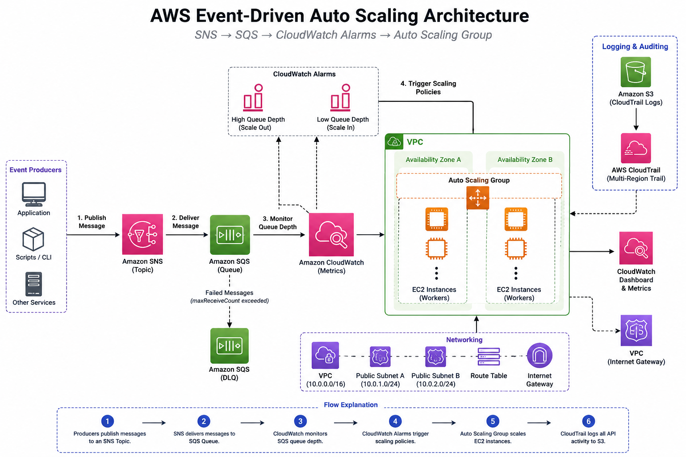
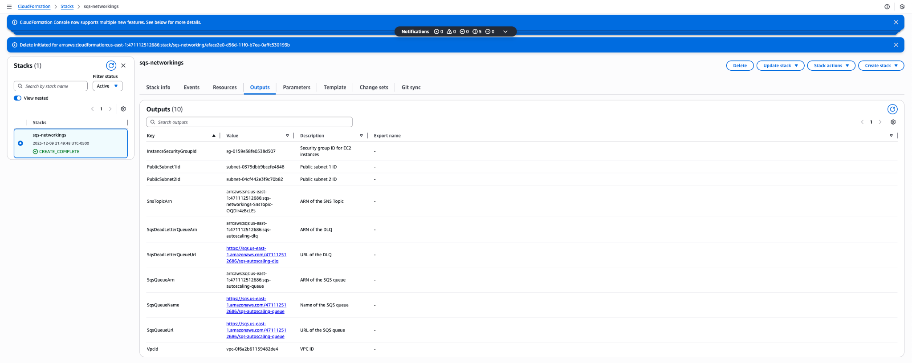
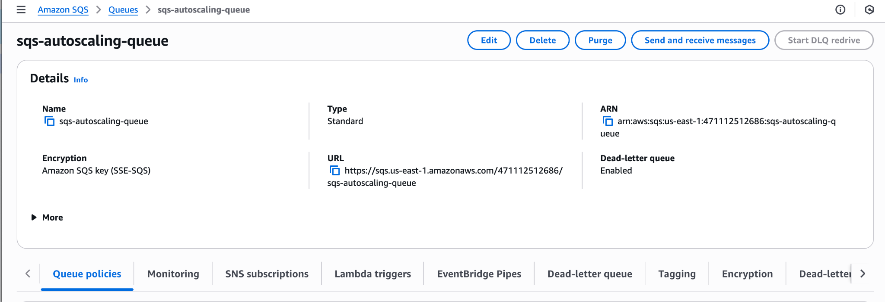
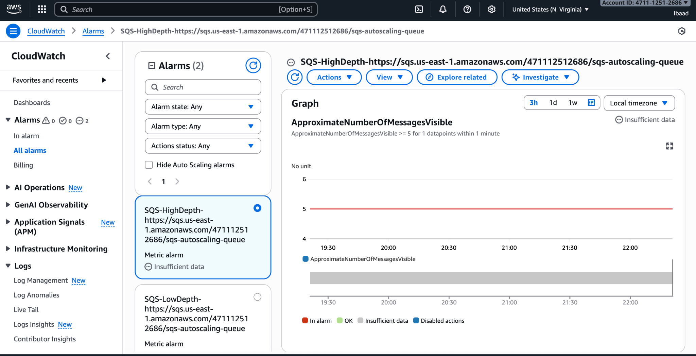
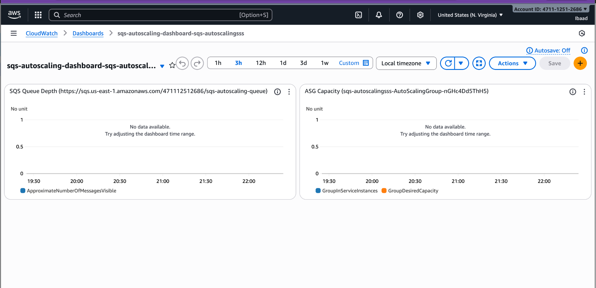
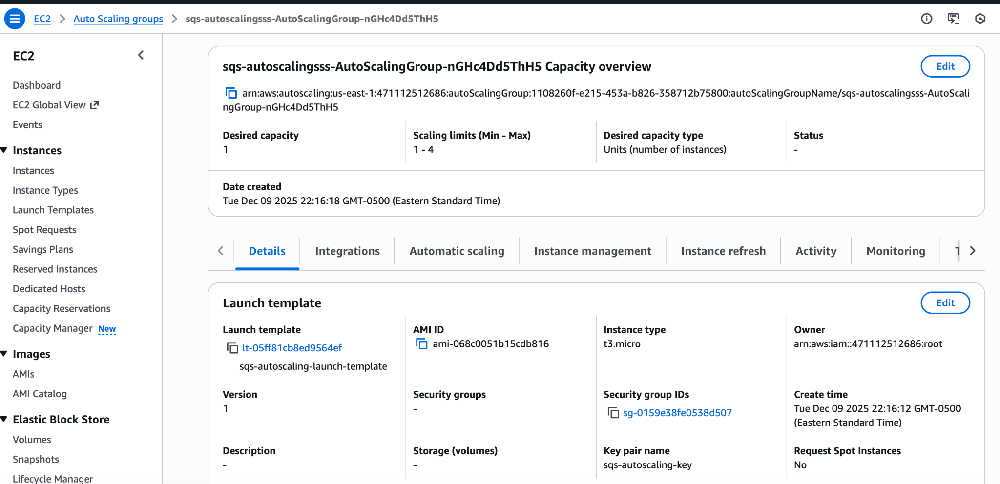
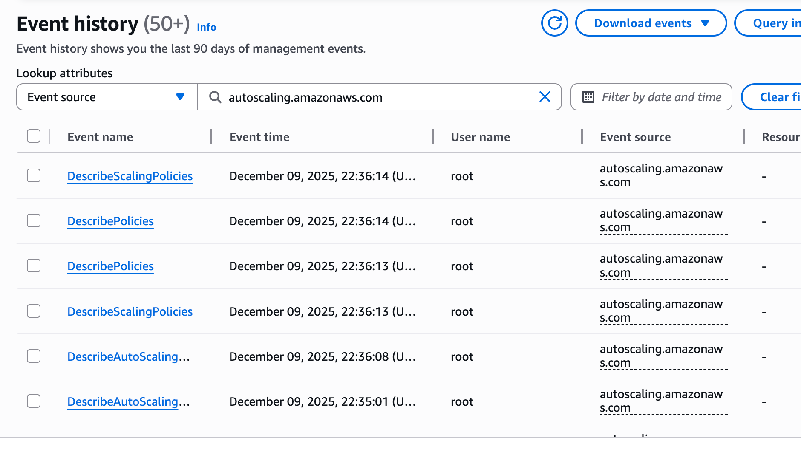

# AWS Event-Driven Auto Scaling

## Project Overview

This project demonstrates an event-driven auto scaling architecture built on AWS using CloudFormation, SNS, SQS, EC2 Auto Scaling Groups, CloudWatch alarms, and CloudTrail monitoring.

The environment automatically scales EC2 worker instances based on SQS queue depth. Messages are published to an SNS topic, delivered to an SQS queue, and CloudWatch alarms trigger scaling policies within the Auto Scaling Group.

---

## Technologies Used

### Cloud Services
- AWS EC2
- AWS Auto Scaling Groups (ASG)
- AWS SNS
- AWS SQS
- AWS CloudWatch
- AWS CloudTrail
- AWS VPC
- AWS IAM
- AWS CloudFormation

### Infrastructure as Code
- YAML
- AWS CloudFormation Templates

### Monitoring & Security
- CloudWatch Metrics & Alarms
- CloudTrail Logging
- IAM Policies
- Security Groups
- Dead Letter Queues (DLQ)

---

## Features

- Event-driven EC2 auto scaling
- SNS to SQS message delivery
- CloudWatch-based scale-out and scale-in policies
- Infrastructure deployment using CloudFormation
- CloudTrail activity monitoring
- CloudWatch dashboard monitoring
- Multi-stack AWS deployment architecture
- Dead Letter Queue (DLQ) integration

---

## Architecture Overview

The architecture consists of:

1. SNS topic publishes messages
2. SQS queue receives messages
3. CloudWatch monitors queue depth
4. Auto Scaling Group scales EC2 instances dynamically
5. CloudTrail captures AWS activity and API events

---

## Repository Structure

```text
aws-event-driven-auto-scaling/
│
├── README.md
├── .gitignore
│
├── architecture/
│   └── aws-event-driven-architecture.png
│
├── cloudformation/
│   ├── sqs-autoscaling-networking.yaml
│   ├── sqs-autoscaling-asg-advanced.yaml
│   └── sqs-autoscaling-cloudtrail.yaml
│
├── screenshots/
│   ├── networking-stack.png
│   ├── sqs-queue.png
│   ├── cloudwatch-alarms.png
│   ├── scaling-dashboard.png
│   ├── autoscaling-group.png
│   └── cloudtrail-events.png
│
└── docs/
    └── Event_Driven_Auto_Scaling_Report.pdf
```

---

## Architecture Diagram



---

## CloudFormation Templates

### 1. Networking + SNS + SQS Stack
Creates:
- VPC
- Public subnets
- Internet Gateway
- Route tables
- Security Groups
- SNS Topic
- SQS Queue
- DLQ configuration

### 2. Auto Scaling Stack
Creates:
- Launch Template
- EC2 Auto Scaling Group
- Scaling Policies
- CloudWatch alarms
- Monitoring dashboard

### 3. CloudTrail Stack
Creates:
- S3 bucket for logs
- CloudTrail trail
- Logging policies
- Multi-region activity tracking

---

## Auto Scaling Workflow

### Scale Out
- SNS publishes messages
- SQS queue depth increases
- CloudWatch high-depth alarm triggers
- Auto Scaling Group launches additional EC2 instances

### Scale In
- Queue messages are purged or processed
- Queue depth decreases
- CloudWatch low-depth alarm triggers
- Auto Scaling Group reduces EC2 capacity

---

## Monitoring & Logging

The project includes:
- CloudWatch queue depth monitoring
- CloudWatch scaling alarms
- CloudWatch dashboards
- CloudTrail event logging
- Auto Scaling activity tracking

CloudTrail captures:
- SNS publish events
- Auto Scaling events
- CloudFormation stack activity

---

## Screenshots

### Networking and Queue Deployment





### Auto Scaling and CloudWatch







### CloudTrail Monitoring



---

## How to Deploy

### 1. Clone Repository

```bash
git clone https://github.com/IbaadShaikh/aws-event-driven-auto-scaling.git
cd aws-event-driven-auto-scaling
```

### 2. Deploy Networking Stack

Upload:

```text
sqs-autoscaling-networking.yaml
```

to AWS CloudFormation.

### 3. Deploy Auto Scaling Stack

Upload:

```text
sqs-autoscaling-asg-advanced.yaml
```

and provide outputs from the networking stack.

### 4. Deploy CloudTrail Stack

Upload:

```text
sqs-autoscaling-cloudtrail.yaml
```

and specify a globally unique S3 bucket name.

---

## Example SNS Publish Command

```bash
for i in {1..20}; do
  aws sns publish \
    --topic-arn "<SNS_TOPIC_ARN>" \
    --message "Test message $i"
done
```

---

## Future Improvements

- Add Lambda consumers
- Add Terraform implementation
- Add private subnets and NAT Gateway
- Add AWS WAF integration
- Add CI/CD deployment pipeline
- Add CloudWatch log analytics
- Containerize worker fleet with ECS

---

## Author

Ibaad Shaikh
